<h1 align="center">🚀 N R Yadav's Full Stack Developer Portfolio</h1>
<h3 align="center">Frontend: HTML5, CSS3, JavaScript | Backend: Node.js + Express | Mail Service: Nodemailer</h3>

---

## 🌐 Live Portfolio

**Frontend**: [🔗 Click here to View MY PORTFOLIO](https://nryadav225.vercel.app)  
**Backend**: [🔗 Click here to View MY SERVER](https://nry-backend-services.onrender.com)

---

## 🧑‍💻 About Me

- 🎓 4th Year B.Tech | Aditya University
- 🧠 Full Stack Developer (MERN)
- 📱 Mobile Dev with React Native Expo
- ☁︎  Google Cloud Platform (GCP)
- ⚡ GeeksforGeeks Campus Ambassador (2024-25)

---

## 🖥️ NRYadav Frontend – Portfolio UI

### 🔷 Home Page
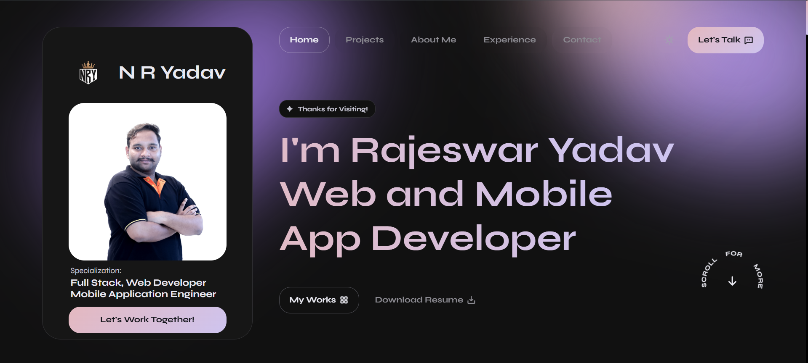

### 🔷 Projects Section - 1
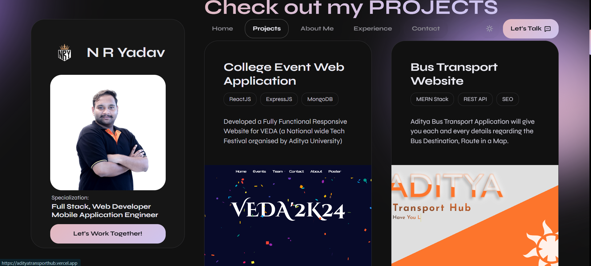

### 🔷 Projects Section - 2
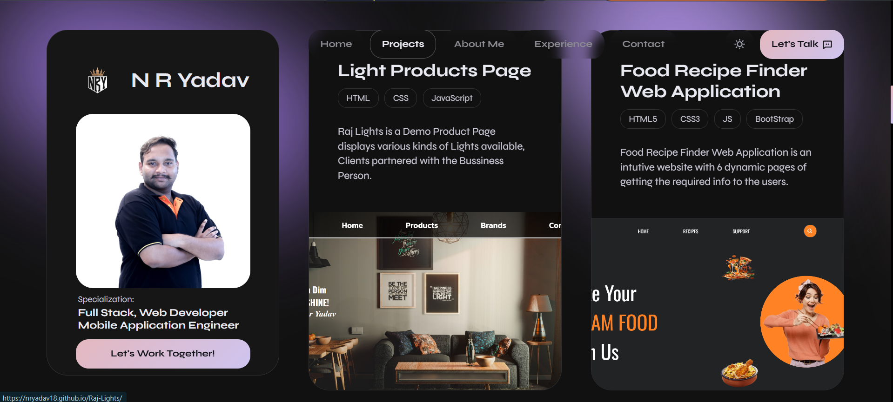

### 🔷 Brief Experience Section
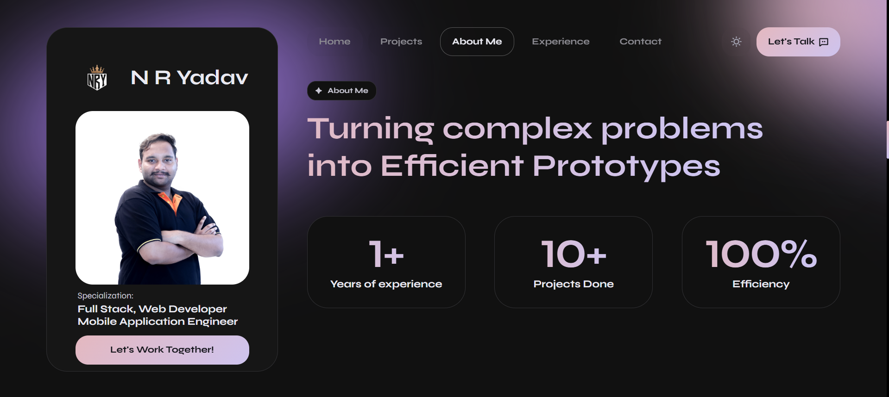

### 🔷 Work Experience Section - 1

### 🔷 Work Experience Section - 2
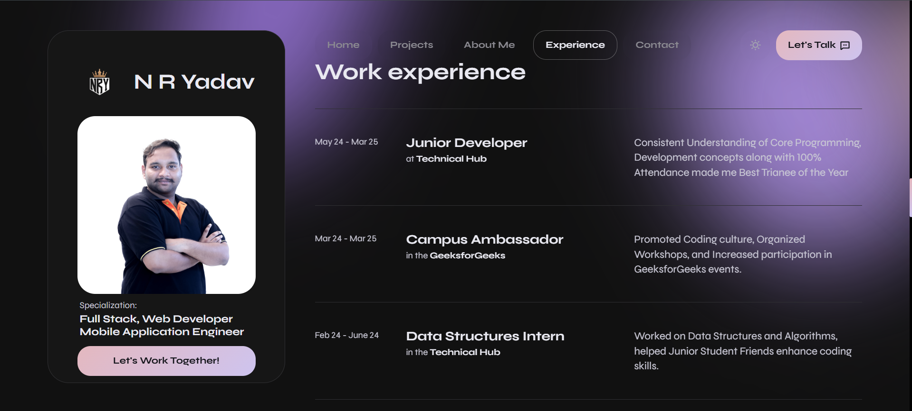

### 🔷 Education Section
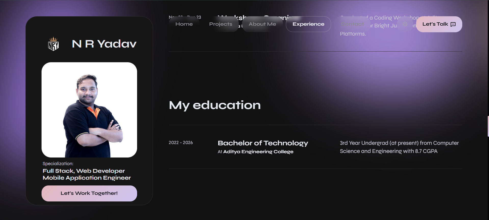

### 🔷 Tech Stack

### 🔷 Client Testimonials - 1
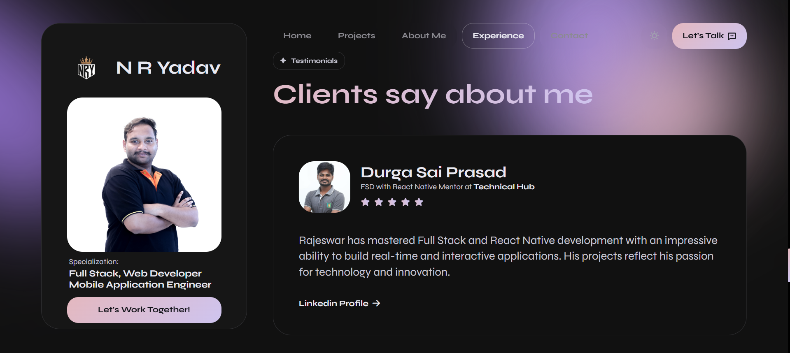

### 🔷 Client Testimonials - 2
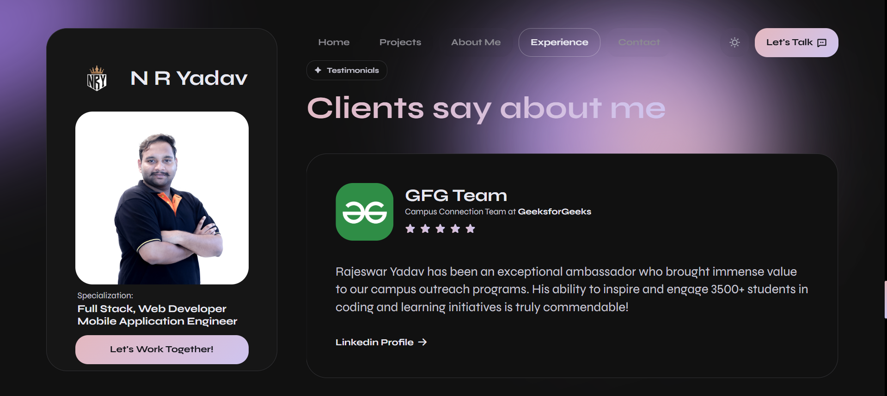

### 🔷 Contact Form  
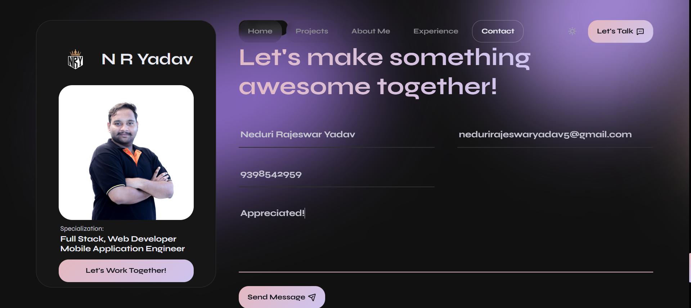

### 🔷 Contact Platforms
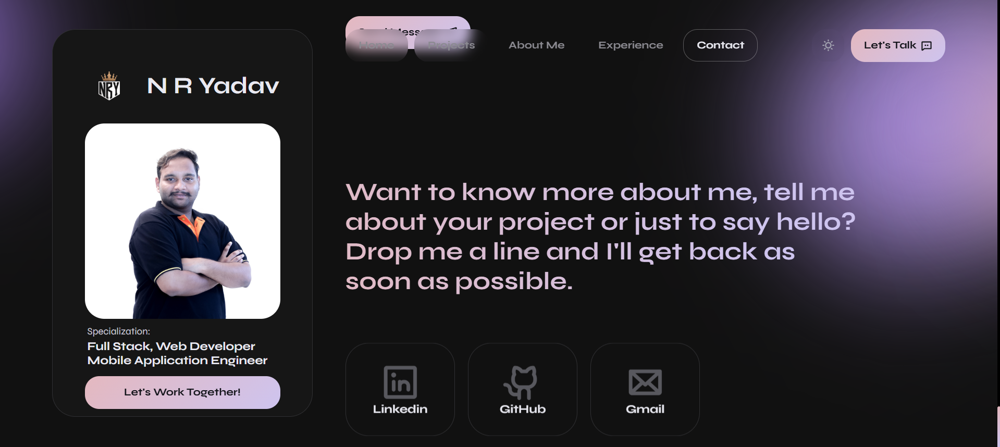

> 📬 Submits the form to the backend and sends an email to me using Nodemailer.

---

## 🔧 Backend – Express Server with Email API

> Folder: `/backend`

### 🔷 Backend Service
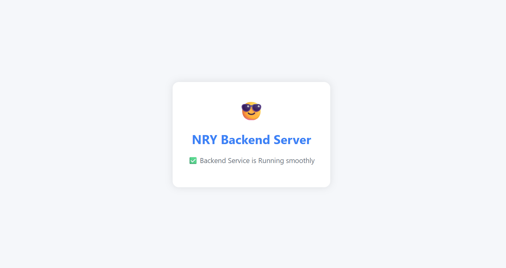

### 🚀 Features

- ✅ Email sending with Gmail & Nodemailer
- ✅ HTML template for clean emails
- ✅ CORS enabled
- ✅ Root route returns an HTML status page
- ✅ 404 & error middleware

# 📡 NRY Backend Server

> A backend Node.js + Express service built to support contact form submissions via email using Nodemailer. Designed for use with a personal portfolio or contact form on the frontend.

---

## 🚀 Features

- 🌐 RESTful API built with Express
- 📬 Email sending using Gmail and Nodemailer
- 🛡️ CORS enabled for cross-origin requests
- 🎨 Root route serves a responsive HTML status page
- ❌ Custom 404 error handling
- 🔐 Environment variable support with `dotenv`

---

## 📦 Installation

git clone https://github.com/nryadav18/nry.v2.0.git

cd backend
npm install

## ▶️ Running the Server

npm start

### or for development:

nodemon app.js

### You’ll see:

✅ Server is Running Smoothly