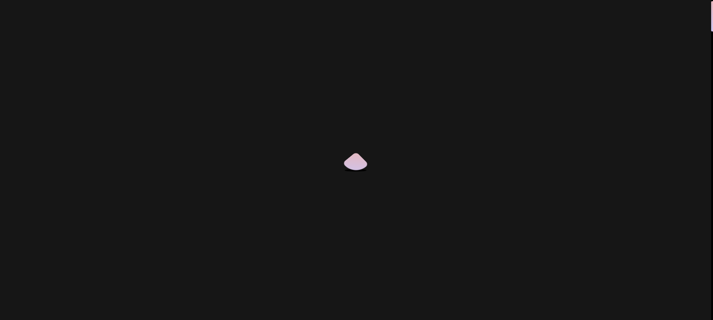
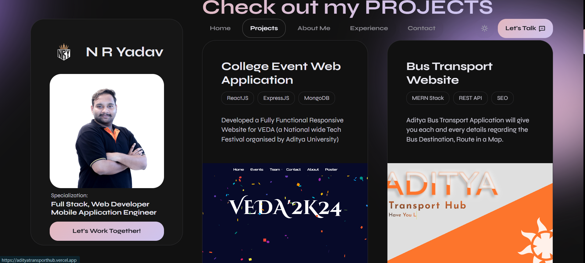
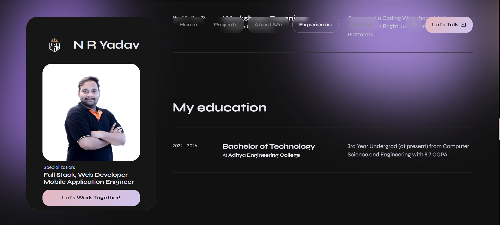
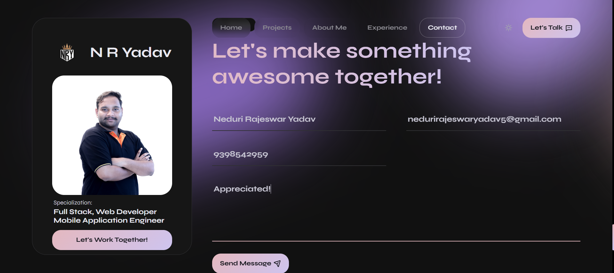
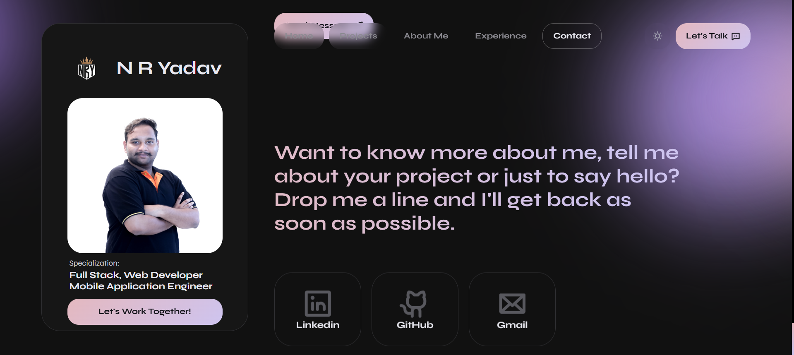

<h1 align="center">⚡ N R Yadav's Full Stack Developer Portfolio</h1>
<h3 align="center">Frontend: HTML5, CSS3, JavaScript</h3>

---

## 🌐 Live Portfolio

**Frontend**: [🔗 Click here to View MY PORTFOLIO](https://nryadav225.vercel.app)

---

## 🧑‍💻 About Me

- 🎓 4th Year B.Tech | Aditya University
- 🧠 Full Stack Developer (MERN)
- 📱 Mobile Dev with React Native Expo
- ☁︎  Google Cloud Platform (GCP)
- ⚡ GeeksforGeeks Campus Ambassador (2024-25)

---

## 🖥️ NRYadav Frontend – Portfolio UI

### 🔷 Home Page

### 🔷 Loader Page  

### 🔷 Projects Section - 1

### 🔷 Projects Section - 2

### 🔷 Brief Experience Section

### 🔷 Work Experience Section - 1

### 🔷 Work Experience Section - 2

### 🔷 Education Section

### 🔷 Tech Stack

### 🔷 Client Testimonials - 1

### 🔷 Client Testimonials - 2

### 🔷 Contact Form  

### 🔷 Contact Platforms

> 📬 Submits the form to the backend and sends an email to me using Nodemailer.
